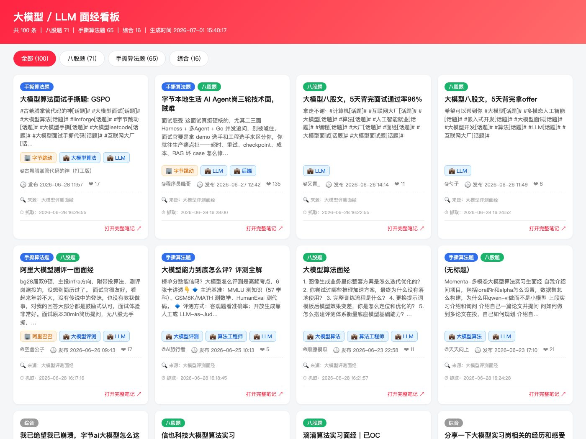
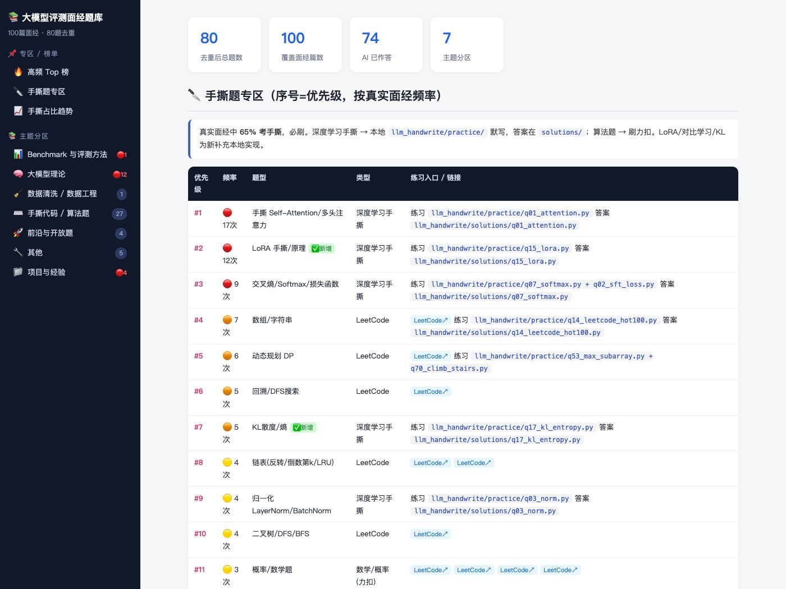

# 小红书大模型面经爬虫


抓取小红书上「大模型评测面经 / 大模型算法面经 / LLM 面试」等关键词的**最新笔记**，
自动按【八股题 / 手撕算法题 / 综合】分类，增量去重保存为 JSON / CSV，并渲染成一个 HTML 看板，方便秋招备战。

---

## 一、环境

项目自带虚拟环境 `venv/`，已装好 `playwright==1.60.0` + chromium，**无需重装**。

```bash
cd xhs-crawler
source venv/bin/activate
```

（如需在全新环境复现：`pip install -r requirements.txt && playwright install chromium`）

---

## 二、三步走（核心用法）

```bash
# 1. 首次扫码登录（打开浏览器，用小红书 App 扫码，登录态会存到 xhs_storage_state.json）
python src/login.py

# 2. 跑一遍所有关键词，增量抓取并保存（跑完会自动刷新看板）
python src/run.py

# 3. （可选）单独重新渲染 HTML 看板
python src/render_html.py
```

抓完后用浏览器打开根目录的 **`面经看板.html`** 即可查看，顶部可按分类切 Tab。

> **边爬边出结果**：`run.py` 不是等全部爬完才出看板。爬虫每攒够一小批（`config.INCREMENTAL_SAVE_EVERY`，默认 15 条）、以及每爬完一个关键词，都会立即落盘并重新渲染 `面经看板.html`，所以**爬取过程中随时刷新浏览器就能看到内容越来越多**；渲染失败也不会中断爬取。

> **尽量爬全今年 + 防封号**：默认 14 个关键词覆盖多种说法、搜索结果尽量切到「最新」排序、配合 `FILTER_YEAR=2026` 只留今年。反封号策略是**有头浏览器 + 随机延时 1.5~4s + 模拟滚动 + 单关键词中等量（60 条）+ 启动参数 `--disable-blink-features=AutomationControlled`**，靠**定时多轮增量累积**爬全，而非单次猛抓。

---

## 生成效果预览

爬取结果会自动分类、去重并渲染成自包含 HTML，以下为实际生成效果：

### 面经看板（`面经看板.html`）

按分类切 Tab（全部 / 八股题 / 手撕算法题 / 综合），卡片展示标题、摘要、作者、发布时间、点赞数与来源关键词。



### 面经题库（按真实提问频率排序 + 手撕专区）

对 100 篇面经去重汇总，按被问次数排优先级，左侧主题分区导航，手撕题映射到本地练习入口。



---

## 三、文件说明

源码统一放在 `src/` 下：

| 目录 / 文件 | 作用 |
| --- | --- |
| `src/config.py` | 配置：关键词、过滤年份、延时、路径、分类规则、浏览器参数 |
| `src/login.py` | 扫码登录，保存 storage_state 登录态到本地 JSON |
| `src/crawler.py` | 核心爬虫：搜索 + 滚动 + 拦截 XHR + DOM 兜底 + 分类 + 去重 + 存储 |
| `src/run.py` | 定时任务入口，跑一遍所有关键词做增量更新，可被 cron/launchd 调用 |
| `src/render_html.py` | 把 `data/` 结果渲染成自包含 HTML 看板（`面经看板.html`） |
| `src/gen_qbank_html.py` | 汇总去重后生成题库静态页面到 `output/` |
| `src/read_note.py` | 按 URL 读取单篇笔记详情（标题/正文/评论等） |
| `src/crawl_final.py` | 备用的整合式爬取脚本 |
| `requirements.txt` | 依赖清单 |
| `docs/` | README 展示用截图 |
| `data/` | 输出目录：带时间戳的快照 JSON/CSV、汇总 `all_notes.json/csv`、去重记录 `seen_ids.json`（不上传） |
| `output/` | 生成的题库 HTML（不上传） |

抓取字段：标题、正文/摘要、作者、发布时间、点赞数、笔记链接、关键词来源、分类标签。

---

## 四、配置（`config.py` 常改项）

- `KEYWORDS`：搜索关键词列表（默认 5 个大模型面经相关）
- `FILTER_YEAR`：只保留该年（含）之后的笔记，默认 `2026`
- `HEADLESS`：是否无头，默认 `False`（方便观察 / 手动过验证）
- `MAX_SCROLL_TIMES` / `MAX_NOTES_PER_KEYWORD`：滚动次数 / 单关键词抓取上限
- `DELAY_*` / `SCROLL_DELAY_*`：随机延时区间（反爬）
- `CATEGORY_*_KEYWORDS`：分类规则关键词

**分类规则**：正文/标题命中「手撕/代码/LeetCode/算法题/写代码/coding…」→ 手撕算法题；
命中「问到/八股/原理/概念/介绍一下/讲讲…」→ 八股题；都没命中 → 综合。允许一条同时命中多个标签。

---

## 五、定时跑（先抓今年的）

### 方案 A：cron（简单）

```bash
crontab -e
```

加入一行（每天 9:30 跑一次，日志追加到 cron.log）：

```cron
30 9 * * * cd /path/to/xhs-crawler && ./venv/bin/python src/run.py >> cron.log 2>&1
```

> 注意：cron 默认无图形环境，若 `HEADLESS=False` 需要桌面已登录；建议定时任务时把 `config.HEADLESS` 改成 `True`。

### 方案 B：launchd（macOS 推荐）

项目已附带示例 `com.xhs.crawler.plist`（每天 9:30 跑）。安装：

```bash
cp com.xhs.crawler.plist ~/Library/LaunchAgents/
launchctl load ~/Library/LaunchAgents/com.xhs.crawler.plist
# 立即手动触发一次测试
launchctl start com.xhs.crawler
# 卸载
launchctl unload ~/Library/LaunchAgents/com.xhs.crawler.plist
```

plist 关键字段：`Program`/`ProgramArguments` 指向 venv 的 python + `run.py`，
`StartCalendarInterval` 设定每天 9:30，`StandardOutPath`/`StandardErrorPath` 写日志。

---

## 六、多种方案说明

本项目采用 **Playwright 浏览器自动化** 为主方案，另有两条备选路线：

1. **主方案 · Playwright 自动化（本项目）**
   打开真实页面、复用扫码登录态、滚动加载，**优先拦截搜索 XHR 响应 JSON**
   （`/api/sns/web/v1/search/notes`）拿结构化数据，DOM 解析作为兜底。
   优点：绕开 web 端 `x-s/x-t` 动态签名，稳、字段全、对小白友好；
   缺点：比纯接口慢，依赖浏览器，selector 可能随改版失效（已加多重兜底 + 日志）。

2. **备选① · API 签名逆向**
   直接逆向小红书 web 搜索接口的 `x-s` / `x-t` 签名算法（JS 混淆 + 设备指纹），
   用 `requests`/`httpx` 直连接口。优点：快、省资源；
   缺点：签名算法频繁变更、逆向门槛高、维护成本大，**风控/封号/合规风险更高**，不建议课程作业用。

3. **备选② · 现成开源项目 MediaCrawler**
   GitHub 上的 `MediaCrawler` 已封装小红书/抖音/B站等多平台抓取（同样走 Playwright + 登录态路线），
   定位是「拿来即用的多平台采集框架」。适合需要快速规模化采集时参考，本项目为教学/可控目的自研精简版。

---

## 七、反爬 / 合规 / 封号风险提示

- 已内置：复用登录态、随机延时、模拟滚动、抓取上限，降低风控概率；但**不能完全避免**。
- 频繁/大量抓取可能触发滑块验证或**临时封号**。建议：控制频率（如每天 1 次）、单关键词别拉太多、用小号。
- 仅供**个人学习 / 面试准备**，请勿商用、勿二次传播他人内容，遵守小红书用户协议与 robots 约定。
- 若出现验证码，保持 `HEADLESS=False` 手动过一下即可。
